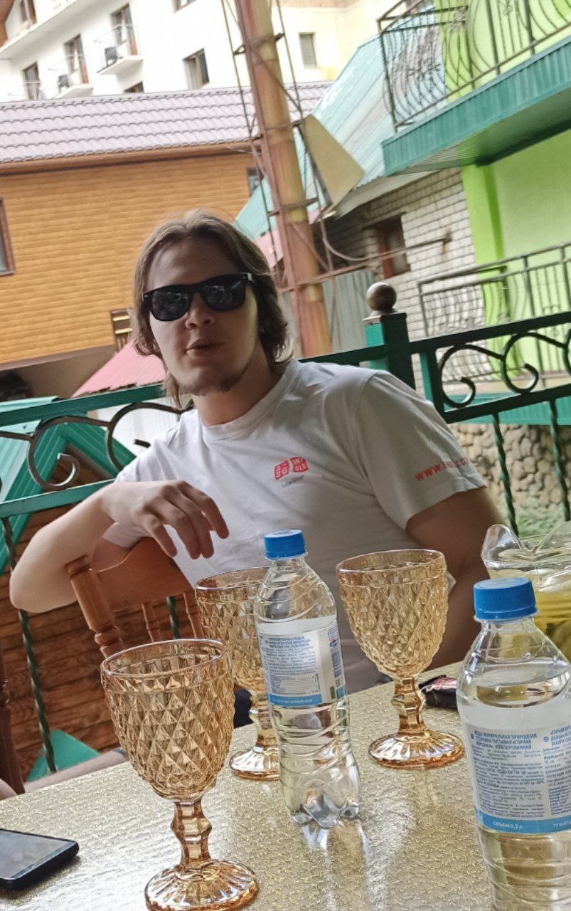

# Roguelike

## Общие сведения о системе

Roguelike — это довольно популярный жанр компьютерных игр, назван в честь игры Rogue, 1980 года выхода. 

* персонаж игрока, способный перемещаться по карте, управляемый с клавиатуры;
* карта обычно генерируется, но для некоторых уровней грузится из файла;
* характеристики персонажа — здоровье, сила атаки;
* у персонажа есть инвентарь, состоящий из вещей, которые он носит с собой;
* вещи из инвентаря можно надеть и снять, надетые вещи влияют на характеристики персонажа;
* вещи изначально находятся на карте, их можно поднять, чтобы добавить в инвентарь;
* снятые вещи находятся в инвентаре, их можно надеть в дальнейшем;
* консольная графика, традиционная для этого жанра игр.

## Architectural drivers

Основным нефункциональным требованием к системе в целом является кроссплатформенность. Для того, чтобы выполнить это требование, было принято решение о написании игры в виде web-приложения. Возможные альтернативы, такие как использование кроссплатформенных игровых движков или консольная реализации графических примитивов для отрисовки игрового мира не подходят. Использование игровых движков потребовало бы время на их изучение всеми членами команды. Отрисовка графики в консоли является отдельной, достаточно трудоемкой задачей, поэтому в силу ограниченных временных ресурсов, эта альтернатива была отвергнута. Также выбор веб-приложения обусловлен простотой распространения в дополнение к кросс-платформенности.

Бизнес ограничением выступало крайне ограниченное время на выполнение проекта. На выполнение работы команда могла потратить не более 120 человеко часов. 

Несмотря на бизнес ограничения, проект должен быть спроектирован и реализован как расширяемый и легко поддерживаемый. Поэтому достаточно много времени было выделено на проектирование системы в целом, а также на обновление документации к проекту.

## Роли и случаи использования

### Роли

* *Gamer*
    Игрок. Является единственным пользователем системы в силу синглплеерности проекта.

### Случаи использования

*Возможности Gamer (Игрок)*:
+ начать игру, запустив игру;
+ перемещать персонажа по карте — с помощью нажатия клавиш `WASD`;
+ узнать текущую статистику: состояние здоровья персонажа, инвентарь и силу урона, посмотрев на `HUD`;
+ атаковать мобов для получения опыта и увеличения силы урона;
+ поднимать экипировку из миру, помещая ее в инвентарь;
+ надевать экипировку из инвентаря и снимать, помещая в инвентарь;
+ узнать уровень моба.

## Описание типичного пользователя

Константин, 22 года, студент. Любит стримы, на которых играют в инди-игры. Там же обнаружил данный рогалик, когда его любимый стример играл в эту игру. Заинтересовался игрой, так как любит минимализм и Начал играть, потому что для игры нет необходимости ничего устанавливать, а Константин сказочно ленив. Так как единственным персональным компьютером в его распоряжении является ноутбук, любые игры не требующие мыши получают одобрение данного пользователя. Вишенкой на торте является любовь к экспериментам в жанрах новых видеоигр, и, как молодой представитель того игрового поколения, которое выросло на ААА-проектах FPS, гонок и экшнов, Константин был удивлён существованием жанра, чьё название звучит как хлебобулочное изделие. Попробовав, Константин быстро проникся минимализмом и аддиктивностью геймплея, сделав данную игру своей любимой и наиболее запускаемой.

## Композиция (диаграмма компонентов и её текстовое описание)

### Компонентами системы являются 

 * *MainMenu*

    Отвечает за приветствие пользователя при старте приложения. 
    Предлагает пользователю начать игру или закрыть приложение. 

 * Подсистема *"In game state"*

  1. Компонент *GameWorld* содержит логическое представление состояния игры. 
  2. Подсистема *Drawer* отвечает за отрисовку текущего состояния игрового поля и *Head-Up Display (HUD)*.
     * *Camera* отрисовывает изменения на игровом поле.
     * *HUD* отображает актуальное состояние характеристик игрового персонажа и инвентаря.

 * *UserListener*

    Считывает пользовательский ввод, интерпретирует его. Передает результат интерпретации в компоненты MainMenu или подсистему "In game state".

## Логическая структура (диаграмма классов и её текстовое описание)

### Camera

Класс реализует интерфейс для взаимодействия с отображением игрового мира. Обеспечивается это с помощью взаимодействия с консолью.

Поля:

> `consoleApi`, с помощью которой класс может взаимодействовать с консолью.

Методы:

> `get(Placement) : IDrawable` - по местоположению возвращает объект, который имплементирует интерфейс `IDrawable`.

> `remove(Placement)` - по местоположению удаляет объект с игрового полю.

### HUD

Класс реализует отображение элементов визуального интерфейса игрока, к ним относятся: здоровье, сила атаки, инвентарь.

Поля:

> `personage: Personage`, ссылка на объект персонажа, которым играет пользователь.

Методы:

> `display()` - отображает `HUD` интерфейс на экране пользователя.

### `<<interface>>` IDrawable

Интерфейс содержит минимальный набор методов, которые должны реализовавывать класса для того, чтобы их можно было отображать в игровом мире.

Методы:

> `draw()` - отображает объект класса, который реализует этот интерфейс, на экране пользователя.

### AbstractCell

Абстрактный класс ячеек. Ячейки занимают важную роль в игровом мире, так как все объекты построены из ячеек.

Поля:

> `texture: String` - представляет собой структуру, которая будет накладываться на ячейку.

Методы:

> `canBeVisited: bool static` - возвращает статус, может ли игрок наступить на ячейку. `true`, если ячейка, если игрок может наступить на ячейку, иначе `false`.

> `getContent: list<Equipment>` - возвращает список содержимого, которое хранится в ячейке, к нему можно отнести: оружия, броню.

### Cell

Представляет реализацию абстрактного класс ячеек, является элементом игрового мира, способна отображаться на экране пользователя, а также взаимодействовать с персонажем.

Поля:

> `content: list<Equipment>` - список вещей, которые содержатся в ячейке.

### Wall

Представляет собой препятствие в игровом мире, которое нельзя пройти персонажу. Является наследником класса `AbstractCell`.

### Placement

Пара координат `X`, `Y`, определяют положение объекта в игровом мире.

> `X, Y : int` - пара координат, которыми определяется местоположение объекта в игровом мире.

### Actor

Абстрактный класс, все классы-наследники представляют собой участников игрового мира.

Поля:

> `hitPoints: Int` - количество очков здоровья.

> `attackPower: Int` - сила атаки.

Методы:

> `move(Placement)` - двигает персонажа по игровому полю.

> `attack(Placement, Int)` - наносит атаку по объекту, который находится по координатам `Placement`.

> `getDamage(Int)` - получить урон.

### Enemy

Класс представляет собой вражескую единицу. Объекты этого класса способны отображаться в игровом мире и наносить урон по персонажу.

> `enemyStrategy` - стратегия, которая определяет поведения врежеской единицы

### AbstractEnemyStrategy

Стратегия, поведение вражеской единицы.

> `doBadThings()` - действие вражеской единицы

### Personage

Класс персонажа, которым управляет игрок.

Поля:

> `inventory: Inventory` - инвентарь персонажа.

Методы:

> `take(Equipment eqpmnt)` - подобрать элемент экипировки.

> `putOn(Equipment eqpmnt)` - положить элемент экипировки в инвентарь.

> `takeOff(Equipment eqpmnt)` - выкинуть элемент экипировки.

### Inventory

Класс инвентаря.

> `List<Equipment> used` - список обмундирований, которые использует персонаж.

> `List<Equipment> unused` - список неиспользуемого обмундирования.

### Equipment

Абстрактный класс экипировки.

Методы:

> `attackDecorator(Placement p, Int points)` - декоратор для накладывания дополнительного урона к атаке пользователя.

> `getDamageDecorator(Int)` - декоратор для накладывания дополнительного эффекта к получаемому урону.

### Helmet

Класс, объекты которого представляют собой шлемы, с различными характеристиками. Является наследником `Equipment`.

### Sword

Класс, объекты которого представляют собой мечи, с различными характеристиками. Является наследником `Equipment`.

### SuperEquipment

Класс, объекты которого представляют собой эксклюзивную экипировку, с различными характеристиками. Является наследником `Equipment`.

## Взаимодействия и состояния (диаграммы последовательностей и конечных автоматов и их текстовое описание)

### Диаграмма последовательностей

* *Run*
    При запуске пользователем приложения создаётся главное меню и отрисовывается.

* *Start New Game*
    При запуске новой игры главное меню прекращает свою жизнь, конструируется игровой мир и отрисовывает себя.

* *Command*
    При вводе пользователем команд игровой мир отвечает на это, фиксируя изменения и отрисовывая себя.

* *Quit*
    При желании пользователя завершить игровую сессию, игровой мир завершает свою жизнь. Конструируется главное меню и отрисовывает себя.

* *Exit*
    При команде завершения приложения, главное меню и приложение завершают свою жизнь.

### Диаграмма конечных автоматов

При запуске игры открывается главное меню.
Игрок может начать новую игру или выйти из игры.

Если игрок начинает новую игру, то генерируется мир, и показывается игроку.

В игровом мире игрок может открыть меню (в которое входит инвентарь)
или совершать действия игрового мира (перемещение, атака, и т.д.).

В игровом меню игрок может вернуться к отображению игрового мира,
совершать действия над инвентарём, или выйти из игры.

Выйти из игры можно в главное меню или из приложения.
В обоих случаях от игрока запрашивается подтверждение,
чтобы предотвратить потерю игрового прогресса от случайного нажатия.
